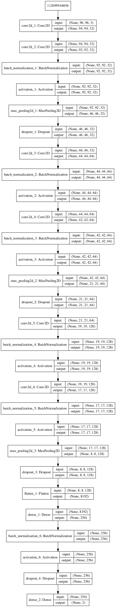
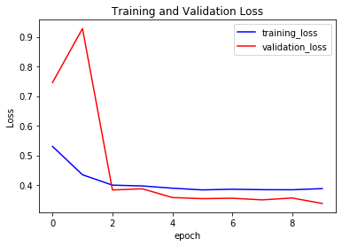
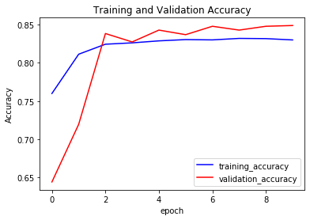
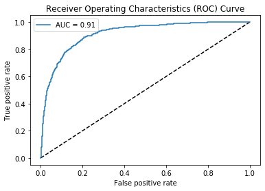
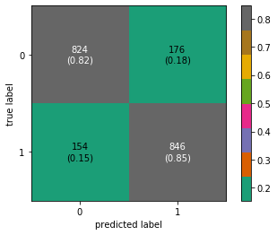

# identify-metastatic-cancer-
In this project, we create an algorithm to identify metastatic cancer in small image patches taken from larger digital pathology scans. The data for this competition is a slightly modified version of the PatchCamelyon (PCam) benchmark dataset. The original PCam dataset contains duplicate images due to its probabilistic sampling, however, the version presented on Kaggle does not contain duplicates.

dataset links
https://www.kaggle.com/c/histopathologic-cancer-detection/data

#### Model Plot

#### Training and validation Loss

#### Training and validation Accuracy

#### Receiver operating characteristic (roc) curve

#### Classification Report

#### Confusion Matrix

